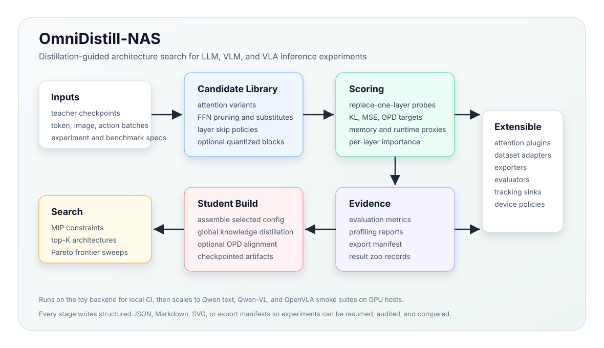

# OmniDistill-NAS

[](https://github.com/Scout-UCAS/OmniDistill-NAS/actions/workflows/ci.yml)
[](https://www.python.org/)
[](https://pytorch.org/)
[](LICENSE)

**Distillation-guided neural architecture search for efficient LLM, VLM, and VLA inference.**

OmniDistill-NAS is an end-to-end research framework for turning large Transformer
teachers into smaller, faster, and more deployable students. It combines
block-level distillation, replace-one-layer scoring, constrained MIP search,
multi-objective Pareto exploration, global knowledge distillation, artifact
evaluation, profiling, export, benchmark manifests, and result tracking in one
reproducible workflow.

It is designed to be useful at two very different scales:

- **Local and CI scale**: a tiny packaged workflow runs quickly and validates the
  complete platform without downloading model weights.
- **GPU research scale**: Qwen text, Qwen-VL, and OpenVLA smoke suites exercise
  real decoder-layer replacement paths on LLM, VLM, and VLA models.

<p align="center">
  
</p>

```bash
git clone git@github.com:Scout-UCAS/OmniDistill-NAS.git
cd OmniDistill-NAS
python3 -m pip install -e ".[dev,docs]"

omnidistill benchmark --dry-run
omnidistill run --config configs/toy_experiment.json
```

## What You Get

OmniDistill-NAS is not just a search script. It is a structured compression
platform with auditable inputs and outputs:

- **Search spaces** for attention variants, FFN replacements, layer skips,
  quantized candidates, and FLA-style alternatives.
- **Distillation-aware scoring** using teacher-student logits, action outputs,
  OPD-style targets, and replacement-local probes.
- **Constrained architecture selection** with MIP objectives over quality,
  memory, runtime, throughput, latency, and diversity.
- **Multi-objective exploration** that exports Pareto configs, Markdown reports,
  and SVG frontier plots.
- **End-to-end workflow stages** for environment preparation, validation, smoke
  tests, candidate library building, scoring, search, assembly, distillation,
  evaluation, profiling, export, and reporting.
- **Real model smoke paths** for Qwen3 text, Qwen3-VL, and OpenVLA-style action
  prediction.
- **Package-ready assets** so the default benchmark works outside a source
  checkout.
- **Extension registries** for attention variants, dataset adapters,
  quantization plans, device policies, evaluators, exporters, trackers, and VLA
  rollout adapters.

## Why It Exists

Modern model compression is not a single ratio or one switch. A practical
inference system has to decide which layers can change, which attention variants
are acceptable, how much memory can be spent per batch size, which latency
budget matters, whether the student still follows the teacher, and whether the
result can be exported and reproduced.

OmniDistill-NAS turns that loop into a staged experiment:

1. Build a candidate library from a teacher block.
2. Score replacements against teacher behavior.
3. Solve constrained architecture search problems.
4. Explore score, memory, and runtime trade-offs.
5. Assemble the selected student.
6. Refine with global knowledge distillation and optional OPD alignment.
7. Evaluate, profile, export, and record the run.

Every important boundary is represented as a file: JSON configs, benchmark
suites, PTH artifacts, metric reports, profiler outputs, export manifests, and
result-zoo manifests. That makes runs inspectable, restartable, and easier to
compare across hardware.

## Installation

OmniDistill-NAS targets Python 3.10+ and PyTorch 2.x.

Minimal install:

```bash
python3 -m pip install -e .
```

Development, docs, tests, and real-model tooling:

```bash
python3 -m pip install -e ".[dev,docs]"
```

The optional `tools` extra includes packages used by real-model smoke suites:

```bash
python3 -m pip install -e ".[tools]"
```

The OpenVLA path currently needs a `timm` version compatible with its remote
model code, so the project pins the optional tool range to:

```text
timm>=0.9.10,<1
```

Generated runtime files are intentionally not tracked by Git:

```text
outputs/       workflow artifacts, reports, profiles, exports
checkpoints/   generated model checkpoints
hf_cache/      Hugging Face model and dataset caches
vendor/        optional workspace-local dependencies
```

## Quick Start

### 1. Validate The Packaged Benchmark

The default benchmark suite is bundled with the Python package, so this command
works even outside the source tree:

```bash
omnidistill benchmark --dry-run
```

### 2. Run The Full Toy Workflow

```bash
omnidistill run --config configs/toy_experiment.json
```

The toy workflow runs all platform stages without requiring external model
downloads:

```text
prepare -> validate -> smoke -> bld -> score -> mip -> multi_objective
        -> assemble -> gkd -> evaluate -> profile -> export -> report
```

Inspect the run:

```bash
omnidistill status --workflow-dir outputs/distill_nas_workflow
omnidistill report --workflow-dir outputs/distill_nas_workflow
sed -n '1,120p' outputs/distill_nas_workflow/report.md
```

Resume from a later stage:

```bash
omnidistill run --config configs/toy_experiment.json --from-stage evaluate
```

Run a single stage:

```bash
omnidistill run --config configs/toy_experiment.json --stage profile
```

### 3. Create Your Own Experiment

```bash
omnidistill init --output configs/my_experiment.json
omnidistill validate configs/my_experiment.json
omnidistill plan --config configs/my_experiment.json
```

JSON and YAML experiment specs are both supported.

## CLI Reference

```text
omnidistill init        Create a starter experiment config
omnidistill run         Run a staged experiment with resume support
omnidistill plan        Print the resolved stage plan
omnidistill validate    Validate experiment, benchmark, or result files
omnidistill benchmark   Run or dry-run a benchmark suite
omnidistill report      Generate workflow or result-zoo reports
omnidistill plugins     List registered extension plugins
omnidistill status      Show workflow artifact status
```

Common examples:

```bash
omnidistill validate configs/toy_experiment.json
omnidistill validate benchmarks/suites/toy_smoke.json --kind benchmark
omnidistill validate results/toy_smoke/manifest.json --kind result

omnidistill benchmark --suite benchmarks/suites/toy_smoke.json --dry-run
omnidistill benchmark --suite benchmarks/suites/qwen3_text_smoke.json --dry-run
omnidistill report --results-dir results
```

Use `--workdir /path/to/workspace` when you want outputs, caches, and optional
local dependencies outside the source checkout.

## Workflow Stages

The default workflow is intentionally split into small, inspectable stages.

| Stage | Script | Purpose | Main output |
| --- | --- | --- | --- |
| Prepare | `scripts/01_prepare_environment.sh` | Create runtime directories, check optional dependencies, configure cache paths | workspace dirs and environment report |
| Validate | `scripts/02_validate_project.sh` | Compile modules, run tests, validate CLI entry points | validation log |
| Smoke | `scripts/03_smoke_tiny_nas.sh` | Run a fast end-to-end NAS sanity check | quick NAS log |
| BLD | `scripts/04_bld_block_library.sh` | Train or initialize candidate replacement blocks | `block_library.pth`, `summary.json` |
| Score | `scripts/05_nas_layer_importance.sh` | Score replacement candidates per layer | `layer_importance.json` |
| MIP | `scripts/06_mip_topk_configs.sh` | Solve constrained grouped selection problems | `topk_architecture_configs.json` |
| Pareto | `scripts/12_multi_objective_search.sh` | Sweep multi-objective trade-offs | Pareto JSON, configs, Markdown, SVG |
| Assemble | `scripts/07_assemble_model_from_config.sh` | Build the selected student | `assembled_model.pth` |
| Distill | `scripts/08_gkd_distill.sh` | Refine the student with GKD/OPD | `gkd_model.pth`, loss summary |
| Evaluate | `scripts/09_evaluate_artifact.sh` | Measure quality and task metrics | `metrics.json` |
| Profile | `scripts/10_profile_artifact.sh` | Measure runtime, throughput, memory | `profile.json` |
| Export | `scripts/11_export_and_report.sh` | Export portable artifact and final report | export manifest, `report.md` |

Run the shell workflow directly:

```bash
bash scripts/run_all.sh
```

See [docs/scripts.md](docs/scripts.md) for every stage-level environment
variable.

## Search And Optimization

The solver works over per-layer candidate groups. Each candidate carries a
quality score, parameter memory estimate, KV-cache memory estimate, runtime
proxy, and optional payload. The MIP selects one candidate per layer while
satisfying constraints.

Single-objective score minimization:

```bash
OBJECTIVE_MODE=score bash scripts/06_mip_topk_configs.sh
```

Weighted score-memory-runtime objective:

```bash
OBJECTIVE_MODE=weighted \
SCORE_WEIGHT=1.0 \
MEMORY_WEIGHT=0.25 \
RUNTIME_WEIGHT=0.25 \
bash scripts/06_mip_topk_configs.sh
```

Batch-specific memory and latency constraints are supported:

```json
{
  "search": {
    "batch_sizes": "1,2,4",
    "memory_max_by_batch": {"1": 8000000000, "2": 10000000000},
    "latency_max_by_batch": {"1": 0.05, "2": 0.08},
    "throughput_min": 1024
  }
}
```

Generate a Pareto frontier:

```bash
GRID_RESOLUTION=5 PARETO_MODE=auto bash scripts/12_multi_objective_search.sh
```

Important search outputs:

```text
outputs/distill_nas_workflow/06_mip_topk_architecture_configs/topk_architecture_configs.json
outputs/distill_nas_workflow/06_mip_topk_architecture_configs/multi_objective_search.json
outputs/distill_nas_workflow/06_mip_topk_architecture_configs/multi_objective_report.md
outputs/distill_nas_workflow/06_mip_topk_architecture_configs/pareto_front.svg
```

## Real Model Smoke Suites

The toy backend is the default platform check. GPU smoke suites cover real
model-loading, multimodal batching, decoder replacement, scoring, and search.

Dry-run command generation:

```bash
omnidistill benchmark --suite benchmarks/suites/qwen3_text_smoke.json --dry-run
omnidistill benchmark --suite benchmarks/suites/qwen_vlm_smoke.json --dry-run
omnidistill benchmark --suite benchmarks/suites/openvla_smoke.json --dry-run
```

Execute a real smoke benchmark:

```bash
HF_ENDPOINT=https://hf-mirror.com \
HF_HUB_DISABLE_XET=1 \
HF_HOME=/path/to/hf_cache \
omnidistill benchmark \
  --suite benchmarks/suites/qwen3_text_smoke.json \
  --result-dir benchmark_runs/qwen3 \
  --allow-commands
```

Available source checkout suites:

| Suite | Model path | What it exercises |
| --- | --- | --- |
| `toy_smoke.json` | Tiny internal model | Full staged platform workflow |
| `qwen3_text_smoke.json` | `Qwen/Qwen3-0.6B` | Text decoder candidate scoring |
| `qwen_vlm_smoke.json` | `Qwen/Qwen3-VL-2B-Instruct` | Vision-language prompt encoding and decoder replacement |
| `openvla_smoke.json` | `openvla/openvla-7b` | VLA image/action path and OpenVLA-compatible loading |

External-command benchmark suites are dry-run safe by default. They execute only
when `--allow-commands` is provided.

### Runtime Validation Snapshot

The following smoke paths were exercised on a CUDA host with an NVIDIA A800 80GB
GPU during the current repository validation pass:

| Path | Status | Approx runtime |
| --- | --- | --- |
| Full toy workflow | completed | 43.3 seconds |
| Qwen3 text smoke | completed | 13.8 seconds |
| Qwen-VL smoke | completed | 14.6 seconds |
| OpenVLA smoke | completed | 24.5 seconds |

These numbers are validation evidence, not universal performance claims. Actual
runtime depends on cache state, model access, GPU type, driver stack, and
dataset availability.

## Experiment Specs

An experiment spec controls backend, stages, model options, search settings,
distillation settings, devices, and environment overrides.

Minimal example:

```json
{
  "name": "toy-platform-smoke",
  "backend": "toy",
  "output_dir": "outputs/distill_nas_workflow",
  "stages": ["prepare", "validate", "bld", "score", "mip", "assemble", "gkd", "evaluate"],
  "model": {
    "seq_len": 16,
    "batch_size": 2,
    "num_batches": 4
  },
  "search": {
    "attention_variants": "parent_attn,mha_attn,quant_mha_attn,mqa_attn,linear_attn,noop_attn",
    "batch_sizes": "1,2,4",
    "top_k": 3
  },
  "distillation": {
    "gkd_steps": 2
  },
  "devices": {
    "device": "auto"
  }
}
```

Validate before running:

```bash
omnidistill validate configs/toy_experiment.json
omnidistill plan --config configs/toy_experiment.json
```

The public schema lives in [schemas/experiment.schema.json](schemas/experiment.schema.json).

## Artifacts And Output Contracts

OmniDistill-NAS favors structured artifacts over implicit state.

Typical workflow output:

```text
outputs/distill_nas_workflow/
  04_bld_block_library/
    block_library.pth
    summary.json
  05_nas_layer_scoring/
    layer_importance.json
  06_mip_topk_architecture_configs/
    topk_architecture_configs.json
    multi_objective_search.json
    multi_objective_report.md
    pareto_front.svg
  07_model_assembly/
    assembled_model.pth
    summary.json
  08_global_knowledge_distillation/
    gkd_model.pth
    summary.json
  09_evaluation/
    metrics.json
  10_profiling/
    profile.json
  11_export/
    manifest.json
  report.md
```

Result manifests are validated with:

```bash
omnidistill validate results/toy_smoke/manifest.json --kind result
```

The public result schema lives in
[schemas/result-manifest.schema.json](schemas/result-manifest.schema.json).

## Benchmarking And Result Zoo

Benchmark suites are JSON manifests under [benchmarks/suites](benchmarks/suites).

```bash
omnidistill benchmark --suite benchmarks/suites/toy_smoke.json --dry-run
omnidistill benchmark --suite benchmarks/suites/toy_smoke.json --result-dir benchmark_runs/toy
```

Generate a result-zoo index:

```bash
omnidistill report --results-dir results --output-md results/index.md
```

See:

- [docs/benchmarking.md](docs/benchmarking.md)
- [docs/result_zoo.md](docs/result_zoo.md)

## Python API

Solve a constrained NAS MIP:

```python
from distill_nas_core.mip import SearchConstraints, solve_nas_mip

solution = solve_nas_mip(
    candidates_by_layer,
    SearchConstraints(
        seq_len=128,
        batch_sizes=[1, 2, 4],
        memory_max_by_batch={1: 8e9, 2: 10e9, 4: 14e9},
        latency_max_by_batch={1: 0.05, 2: 0.08, 4: 0.14},
        objective_mode="weighted",
        score_weight=1.0,
        memory_weight=0.25,
        runtime_weight=0.25,
    ),
)

print(solution.selected_names)
```

Register an attention variant:

```python
from distill_nas_core.search_space import register_attention_variant

register_attention_variant(
    "my_attention",
    spec_factory=my_spec_factory,
    module_factory=my_module_factory,
    aliases=["my_attn"],
)
```

Register an evaluator:

```python
from distill_nas_core.evaluation import register_evaluator

def evaluate_my_backend(path, **kwargs):
    return {"accuracy": 0.0, "artifact": str(path)}

register_evaluator("my-backend", evaluate_my_backend)
```

Register a tracking sink:

```python
from distill_nas_core.tracking import register_tracking_provider

def tracking_provider(event, payload):
    print(event, payload or {})
    return {"status": "ok"}

register_tracking_provider("stdout", tracking_provider)
```

## Extension Surface

OmniDistill-NAS is intentionally small at the core and open at the boundaries.

| Extension point | Module | Typical use |
| --- | --- | --- |
| Attention variants | `distill_nas_core.search_space` | Add a custom attention module or alias group |
| Dataset adapters | `distill_nas_core.data_adapters` | Load prompts, images, actions, or task labels |
| Quantization plans | `distill_nas_core.quantization` | Compare dense and quantized block decisions |
| Device policies | `distill_nas_core.distributed` | Route teacher/student devices and accumulation |
| Evaluators | `distill_nas_core.evaluation` | Add backend-specific metric computation |
| Exporters | `distill_nas_core.export` | Write custom model packaging formats |
| Tracking providers | `distill_nas_core.tracking` | Emit events to JSONL or external services |
| VLA rollout adapters | `distill_nas_core.vla` | Connect action policies to environments |
| Plugin manifests | `distill_nas_core.plugins` | Activate entry points from structured manifests |

See [docs/plugins.md](docs/plugins.md).

## Repository Layout

```text
distill_nas_core/
  blocks.py             candidate attention and FFN blocks
  search_space.py       variant registry and search-space construction
  scoring.py            layer replacement scoring utilities
  mip.py                constrained NAS solver
  multi_objective.py    Pareto and weighted objective search
  distill.py            GKD and OPD training utilities
  evaluation.py         artifact evaluation
  profiler.py           latency, throughput, memory profiling
  export.py             portable artifact export
  benchmarks.py         benchmark suite runner
  schema.py             public config/result validation
  plugins.py            extension registry
```

```text
scripts/       shell workflow stages
tools/         Python entry-point utilities
configs/       experiment specs
benchmarks/    benchmark suite manifests
results/       reproducible result manifests
schemas/       public JSON schema files
docs/          English and Chinese documentation
notebooks/     notebook and Colab demos
website/       static project homepage
tests/         unit and integration tests
```

## Quality Bar

Recommended local checks:

```bash
python3 -m pytest -q
python3 -m ruff check distill_nas_core tools tests scripts
python3 -m mypy distill_nas_core tools tests
python3 -m build
mkdocs build --strict
```

Project-level check:

```bash
python3 tools/check_project.py
python3 tools/check_project.py --workflow
```

The current suite covers:

- MIP search and weighted objectives
- Pareto extraction and report generation
- artifact evaluation, profiling, export, and reports
- packaged benchmark assets outside the source tree
- YAML and JSON schema validation
- Qwen text, VLM, and VLA helper behavior
- plugin and extension registries
- toy staged workflow planning and execution

## Troubleshooting

### `python3` is not on the server PATH

Benchmark command entries that start with `python` or `python3` are resolved to
the active interpreter at runtime. You can still run explicitly with:

```bash
/path/to/python -m distill_nas_core.cli benchmark --suite benchmarks/suites/toy_smoke.json
```

### Hugging Face downloads time out

Use your preferred mirror or cache directory:

```bash
HF_ENDPOINT=https://hf-mirror.com \
HF_HUB_DISABLE_XET=1 \
HF_HOME=/data/hf_cache \
omnidistill benchmark --suite benchmarks/suites/qwen3_text_smoke.json --allow-commands
```

### OpenVLA model loading fails with SDPA or TIMM errors

The loader falls back to eager attention for known OpenVLA SDPA gaps. Make sure
the optional dependencies use the project-supported TIMM range:

```bash
python3 -m pip install -e ".[tools]"
python3 - <<'PY'
import timm
print(timm.__version__)
PY
```

Expected range:

```text
>=0.9.10,<1
```

### Generated files are large

Checkpoints and model caches can be large. They are ignored by Git and should be
stored as run artifacts rather than committed:

```text
outputs/
checkpoints/
hf_cache/
vendor/
```

## Documentation

- [Full documentation](docs/README.md)
- [中文文档](docs/README.zh-CN.md)
- [Workflow scripts](docs/scripts.md)
- [Benchmarking](docs/benchmarking.md)
- [Result zoo](docs/result_zoo.md)
- [Tracking](docs/tracking.md)
- [Plugin guide](docs/plugins.md)
- [API reference](docs/api.md)
- [Design notes](docs/design.md)
- [Toy workflow tutorial](docs/tutorials/toy_workflow.md)
- [Qwen text tutorial](docs/tutorials/qwen3_text.md)
- [VLM and VLA tutorial](docs/tutorials/vlm_vla.md)

## Project Status

OmniDistill-NAS is research software. The toy workflow is intended to be
CI-friendly and fast on local machines. Real-model workflows depend on model
availability, device memory, optional FLA support, dataset access, cache state,
and hardware profiling conditions.

The project is alpha but end-to-end:

- APIs are usable.
- Tests and schema validation are in place.
- Toy, Qwen text, Qwen-VL, and OpenVLA smoke paths have been exercised.
- Result manifests and benchmark suites are structured and versionable.

Large-model result manifests should be treated as reproducibility targets, not
universal performance claims.

See [ROADMAP.md](ROADMAP.md) for planned work.

## Contributing

Contributions are welcome across search spaces, model adapters, dataset
formatters, benchmark manifests, documentation, CI, and real-model run records.

Start with:

- [CONTRIBUTING.md](CONTRIBUTING.md)
- [CODE_OF_CONDUCT.md](CODE_OF_CONDUCT.md)
- [SECURITY.md](SECURITY.md)

When contributing benchmark or performance changes, include a result manifest or
the exact command needed to reproduce the claim.

## Citation

If OmniDistill-NAS helps your research, please cite the repository using
[CITATION.cff](CITATION.cff). A formal paper citation can be added when the
accompanying report is released.

## License

OmniDistill-NAS is released under the [MIT License](LICENSE).
